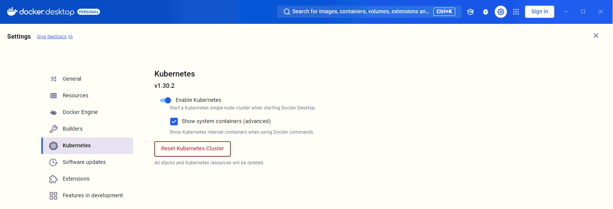
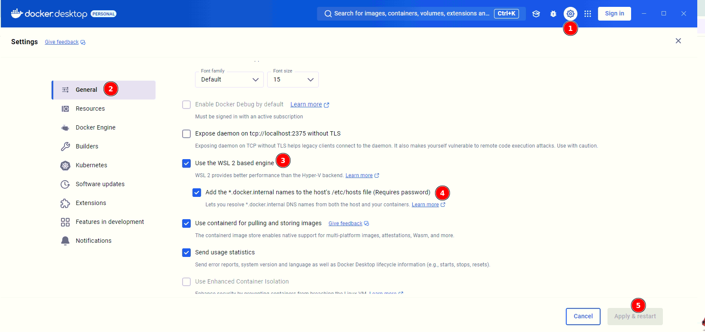
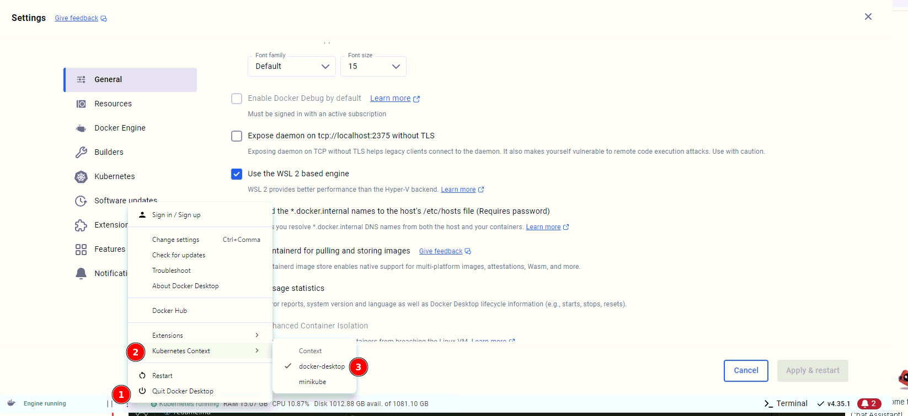

# Setup k8s cluster on Windows

1. Download and install Docker Desktop for Windows from [Docker Hub](https://hub.docker.com/editions/community/docker-ce-desktop-windows/).
2. Enable Kubernetes in Docker Desktop settings.

3. Enable WSL 2, allow Add the *.docker.internal to the DNS search domains, and set the Kubernetes context to Docker Desktop.

4. Start Docker Desktop and wait for the Kubernetes cluster to be ready.
5. Check the K8s cluster by command `kubectl get nodes`.

6. Deploy metrics-server on Windows Docker Desktop. See the [metrics-server](metrics-server/readme.md) setup guide.

Notes:
- If you have multiple Kubernetes contexts, you can switch between them by using the Docker Desktop settings.

